.. toctree::
   :maxdepth: 2
   :caption: Contents:

General Flow Description
========================

The EO4EU platform enables users to access, process, and analyse Earth
observation data by integrating various data sources, automating
workflows, and providing advanced visualisation tools. It supports data
discovery, workflow creation, fusion algorithms, and machine learning
applications to extract meaningful insights from geospatial data.

**Steps to Use the EO4EU Platform:**

1. **Register and Log In**
   
   Create an account and log in to access your profile, manage applications, and configure settings (see Account).

2. **Search for Data**
   
   Use the Data Search tool to find relevant datasets by selecting a data source, applying filters such as area of interest and date range, and retrieving the necessary data.

3. **Create a Workflow**
   
   In the Workflow Creator, define a new workflow by selecting datasets and structuring the workflow. You can also upload in-situ data if needed.

4. **Edit the Workflow**
   
   Open the Workflow Editor to design and configure your workflow by dragging and dropping components, setting parameters, and applying processing techniques (see Fusion Functions).

5. **Execute and Monitor the Workflow**
   
   Save and publish the workflow to start processing. Track progress through the platform’s status indicators and real-time notification system. Email notifications are also sent in case of workflow completion or failure.

6. **Visualize and Analyse Data**
   
   Explore processed results using Data Visualization for graphs, Map Visualization for geospatial overlays, and XR/VR Visualization for 3D analysis.

7. **Manage Files and Track History**
   
   Access workflow outputs in the File Explorer, execute advanced commands in the Console, and review past workflows in the History section for tracking and iteration.

Authentication & Account Management
===================================

To access the EO4EU platform, the user must register to the platform.
Once you access the Web Portal for the first time, you will see the
sign-in screen.

.. image:: media/image1.png
   :width: 4.08511in
   :height: 3.1293in

As you can see, there is a register button that you can press to
register yourself as a new user.

.. image:: media/image2.png
   :width: 2.63621in
   :height: 3.17021in

Once you have registered and you can access the Web Portal, there is a
section "Account" on the left menu

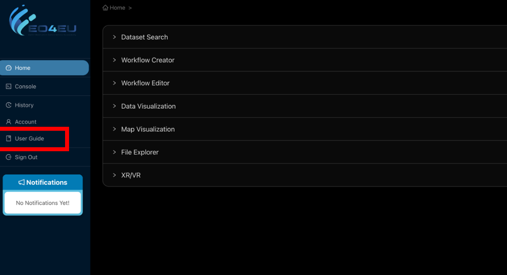

which allows you to see/edit your personal details and see the
applications that you have access to.

.. image:: media/image4.png
   :width: 6.5in
   :height: 2.04236in

Dashboard
=========

The dashboard provides an overview of your data and workflows.

.. image:: media/image78.png
   :width: 5.3522in
   :height: 2.90426in

Data Search
===========

The first step in using the EO4EU platform is to search for the data
needed. One of the platform's main contributions is that it allows
semantic data search through various data sources, including the option
to upload datasets. Once the user logs in to the portal, the first
accordion section is entitled "Dataset Search", which is the tool used
to search through data sources semantically. From the drop-down menu,
the user can choose the data source and provide a keyword.

.. image:: media/image5.png
   :width: 5.21277in
   :height: 2.33683in

Once the data source and keyword are defined, the user can search using
the search button on the top right and the most matching results will be
shown.

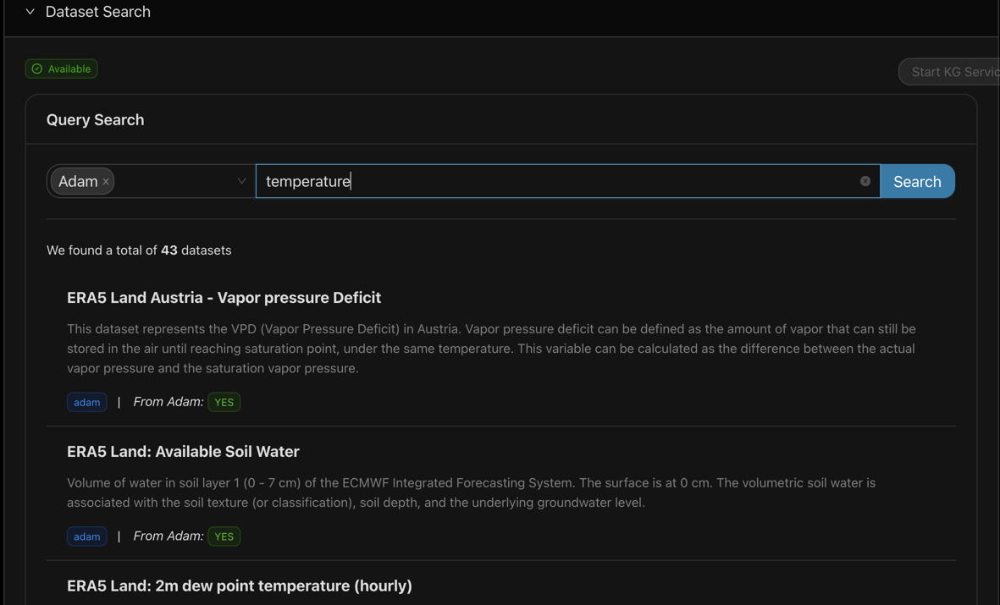

Once the user chooses the dataset of interest, a specialised menu
provides more details/options. The example for the ADAM data source
includes a description of the dataset, its variables, file formats, and
data types.

.. image:: media/image7.png
   :width: 6.1967in
   :height: 3.55979in

Additionally, another section of this menu is the Advanced Filter where
the user can choose the area of interest on the map.

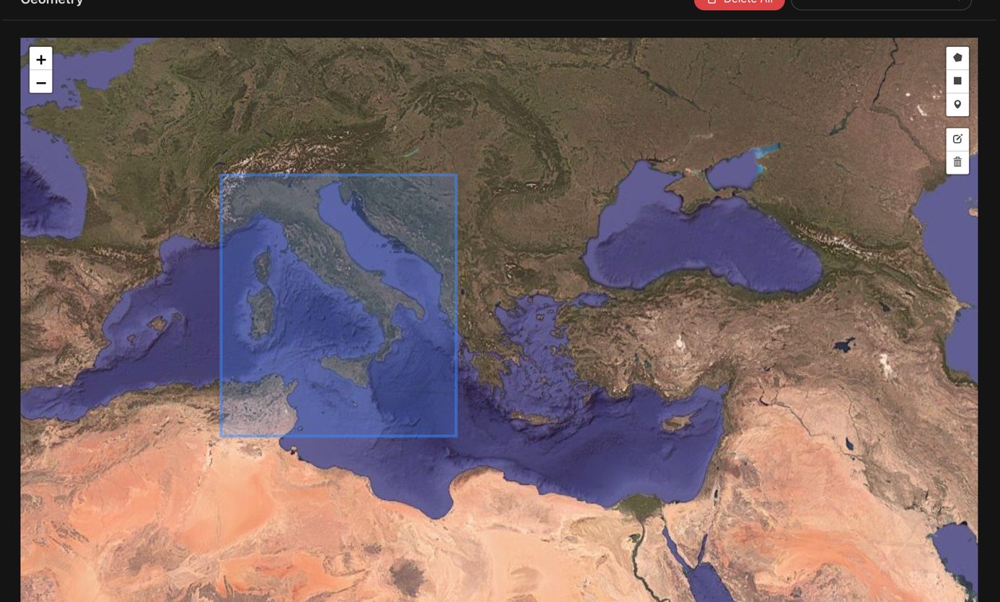

Once the area is defined, the user can choose the date ranges.

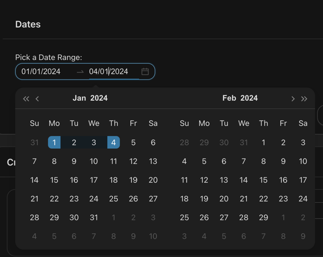

Once the date range is defined, you can filter them to identify the
correct products to download and select the button **“Filter now”.**

.. image:: media/image10.png
   :width: 3.72094in
   :height: 1.51064in

Then, the user clicks the Generate Script button to create the Python
Script and the MetaInfo JSON that will be passed to the Workflow Editor
Component.

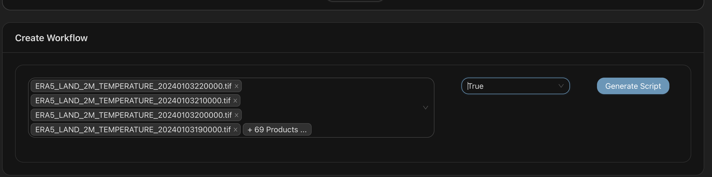

The user as a final step shall select the button “\ **Save WF
product**\ ”. The next step is the Workflow Creator.

.. image:: media/image12.png
   :width: 4.73041in
   :height: 1.86892in

Workflow Creator
================

Workflow creator is the common space where a user can have an overview
of all the saved workflow products in their account. In this section, a
user shall type a workflow name in the respective field. Afterwards the
user shall either select some workflow products to be used in this
workflow or select none in order to create an empty workflow. An empty
workflow can be used to upload, in the next step, in-situ data. The
user, after selecting the preferred workflow products, if needed, and
adding a workflow name, can press the “\ **Create Workflow**\ ” button
to create the workflow in the workflow editor.

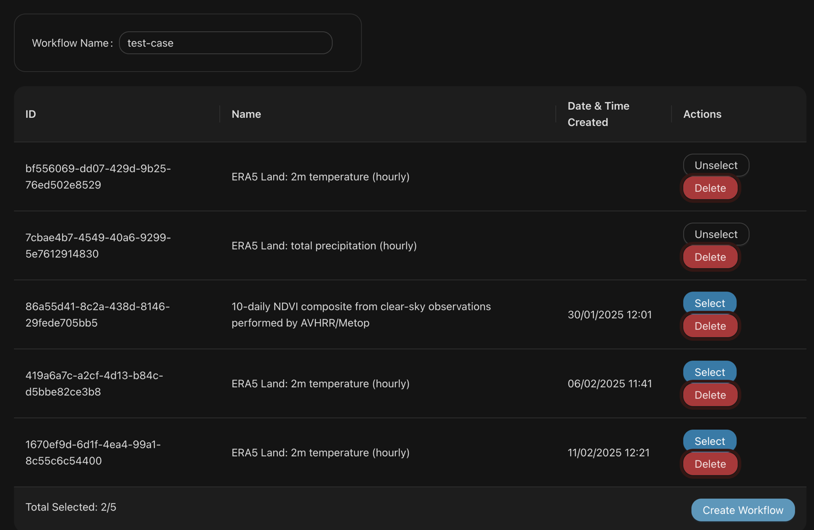

For the specific use case, shown in the picture above, we named our use
case as “test-case”, we selected 2 workflow products, and we selected
the “\ **Create workflow**\ ” button. A user can check if the workflow
was created correctly by the notification area and the message success
in the left part of the platform.

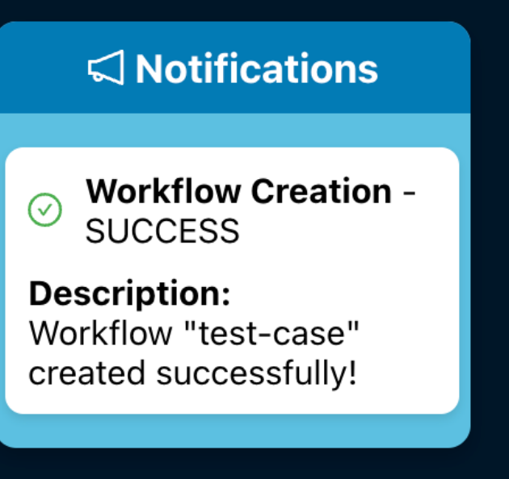

The next step is for the user to create a chain of actions (schema) in
the Workflow Editor for the specific data input.

Workflow Editor
===============

Workflow Editor (WFE) is a component of the EO4EU platform, where a user
can manage (publish, delete and save as draft) a workflow.

In the application there are two basic views. The view that the user can
see and manage all the workflows that have been created, as well as
their status, and the editing view.

.. image:: media/image15.png
   :width: 5.18126in
   :height: 3.28977in

The status of each workflow is visible in each workflow item. All
possible statuses are:

-  compiling
-  compiled
-  publishing
-  published
-  stopping
-  stopped
-  completed
-  error
-  draft

With the 3-dot menu, in the top right corner of any item, a user can see
publish, view or delete an item depending on its state.

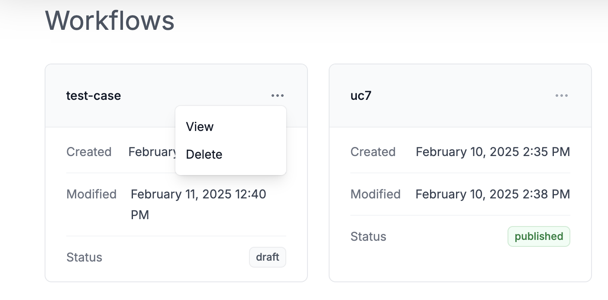

.. |img2| image:: media/image17.png
   :width: 45%

|img1| |img2|

If a user selects **“View”**, the workflow editor builder opens. The
editor is divided into three main sections. The top bar where the user
can save his work or publish it, the editing canvas, and the marketplace
of the components available on the left for insertion into the workflow.
It should be noted that items in the marketplace are searchable. A user
can return in the previous page by clicking the left arrow close to the
workflow name.

The workflow building process is handled by dragging-and-dropping items
from the marketplace to the canvas and connecting them.

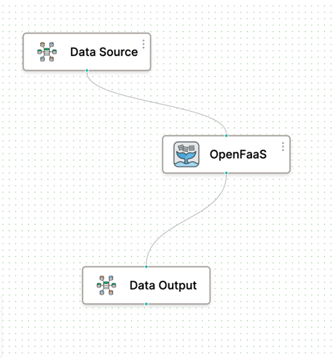

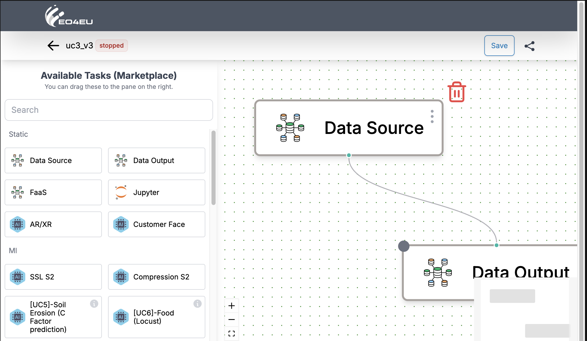

|img3| |img4|

Editable items have a 3-dot menu. Clicking on it opens a new window in
which the user can edit the parameters of each component. Items can be
deleted if the pointer hovers at the right up corner (red trashcan
symbol).

Detailed information for the use cases can be shown if you press the
three dots of the components in the marketplace.

.. image:: media/image20.png
   :width: 4.44783in
   :height: 2.682in

In the data source, users can upload new files and manage their files
and directories.

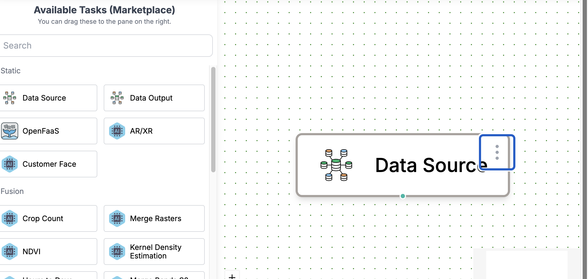

All the in-situ data shall be registered with the same notation as that
of all data sources integrated in the KG. The in-situ data can then be
permantly stored in the KG as an added datasource. The new data can be
characterized as a new Data Source.

.. image:: media/image22.png
   :width: 4.73586in
   :height: 3.26956in

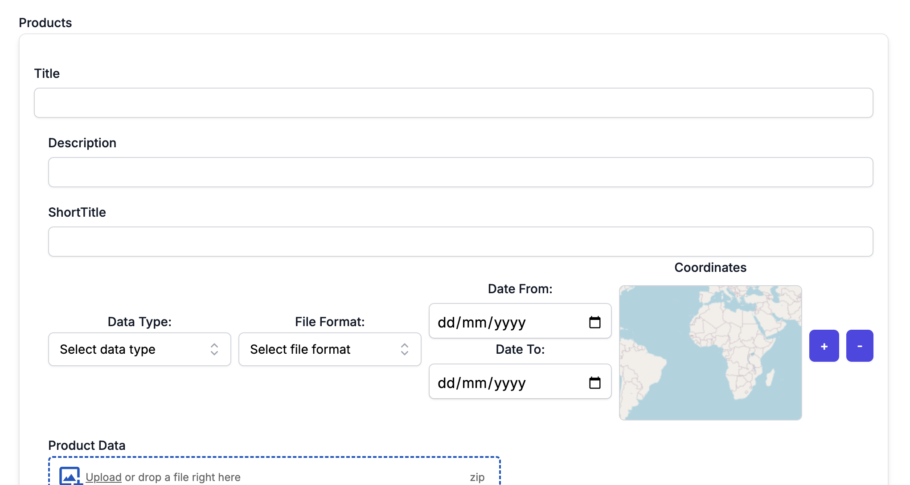

When the chain of the actions is completed, the user can either save the
workflow or publish the workflow. Publishing means that the workflow is
started immediately.

.. image:: media/image24.png
   :width: 6.5in
   :height: 3.57014in

Once the workflow has started, the progress of the workflow can be found
in the notifications section of the EO4EU portal. Furthermore, email
notifications are sent to the user in case of workflow completion or
error. As a result, the user can step off the WFE and come back should
he receive an email from the platform.

.. image:: media/image79.png
   :width: 1.35511in
   :height: 1.65628in
|
.. image:: media/image80.png
   :width: 60%
   :height: 1.45628in

The results of the Workflow
===========================

Once the workflow processing has been completed, the output files can be
visualised in three ways. If the results are GeoTIFFs, they can be
visualised on maps by overlaying layers in 2D through the **"Map
Visualisation"** component. The results can be visualised on graphs or
tables through the **"Data Visualisation"** component if the results are
arithmetic data. Finally, the platform provides the option to visualise
the data in a 3D mode through the **"XR/VR"** component. More details on
these three components can be found in the following subsections. The
files can also be accessed in the **"File Explorer"** section.

Data Visualization
------------------

The Data Visualization tool provides various charts and graphs to help
users understand and analyse their data. Users can customise their
visualisations and save them for future reference. The users can choose
their workflow of interest from the dropdown list and generate charts
using the **Add Chart** button.

.. image:: media/image26.png
   :width: 6.5in
   :height: 1.25556in

When the users press on the **Add Chart** button, the menu shown below
appears to choose the file to visualise.

.. image:: media/image27.png
   :width: 6.5in
   :height: 2.32153in

Once the file is chosen, another menu appears to configure what the
chart will present.

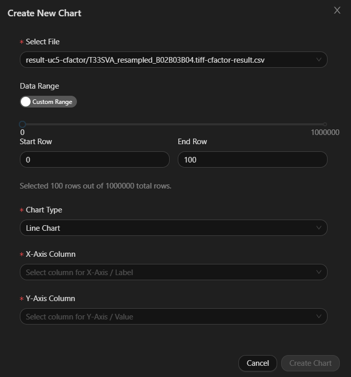

When all the configurations are provided, the user will press on
**Create Chart** and the chart will be created. The user can create as
many charts as needed with either one or two charts per row.

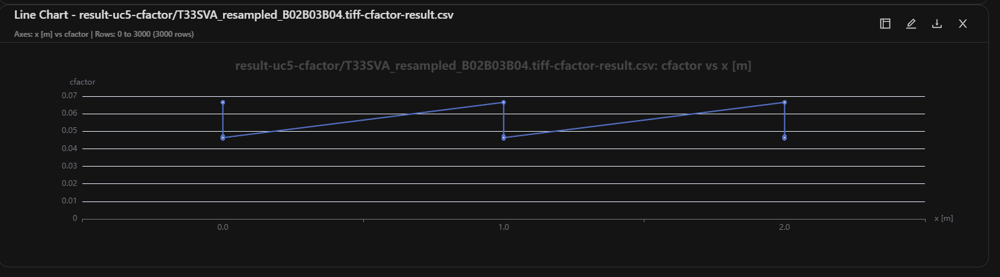

Map Visualization
-----------------

The Map Visualization tool allows users to visualise geospatial data on
a map. Users can overlay different datasets and use various spatial data
analysis tools. The user can choose the Workflow with available data
from the Workflow dropdown menu and select the file (or multiple files)
they want to visualise. The tool can visualise TIFF, NetCDF and
shapefiles.

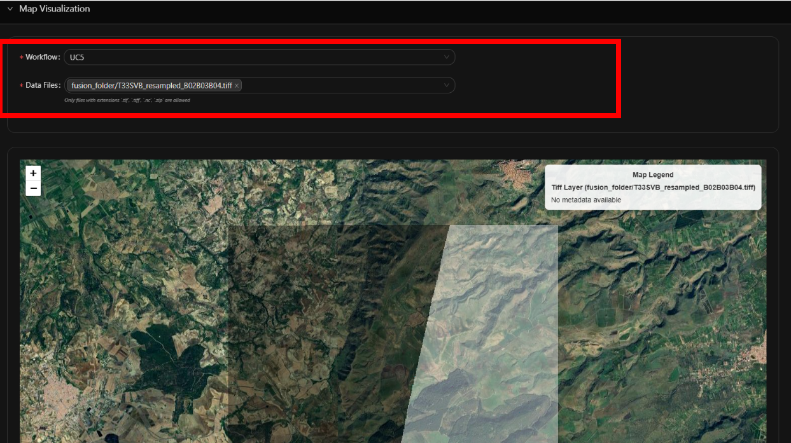

XR/VR
-----

This tool allows the user to explore the output data and the
intermediate results of a specific workflow in an Extended Reality (XR)
environment, namely Virtual Reality (VR) environment and Augmented
Reality (AR) environment. Currently, on the dashboard it is only
possible to visualize the data in a Virtual Reality environment. To
enable the XR visualization on a specific workflow, during its creation
within the Workflow Editor application, the AR/XR task needs to be
linked to the data output task as shown in the following image:

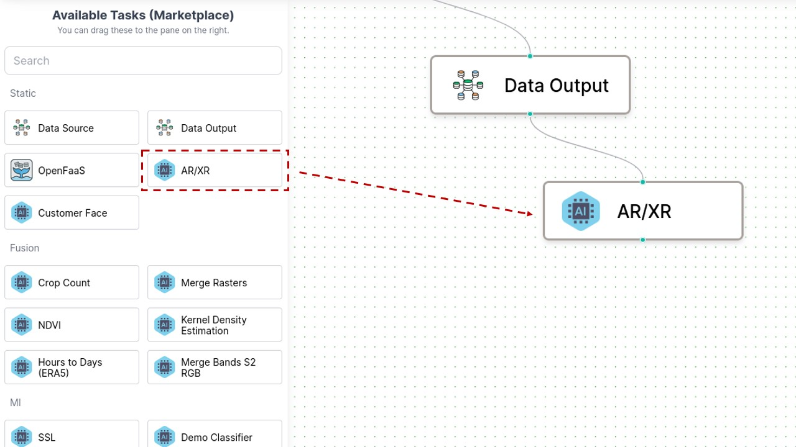

When a specific workflow is selected using the select workflow section
in the dashboard, if the XR visualization was enabled during the
creation phase of the workflow, the VR visualization of its resulting
data is available by opening the XR/VR tab in the dashboard’s **Home**
section. In the VR interface home page, all the areas covered by the
data resulting from the selected workflow are displayed as selectable
bounding boxes on a globe. If a device supporting VR sessions is
detected, a button appears on the top-right corner of the application
and can be used to start a VR session.

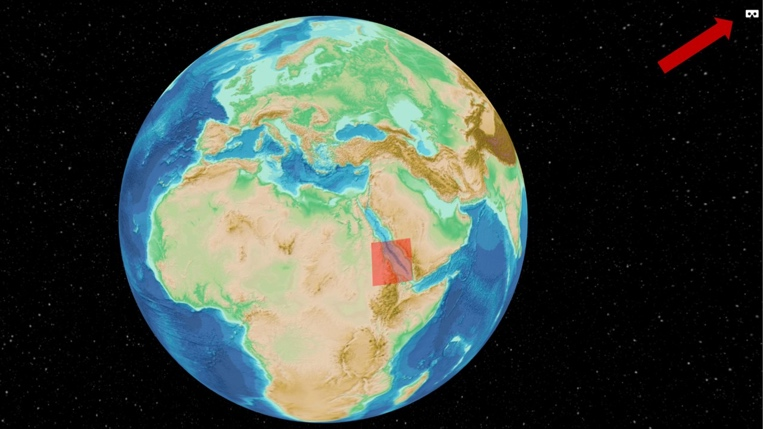

By selecting a specific bounding box, it is possible to visualize the
data related to the selected area jointly with a basic set of metadata.
During a VR session, a wrist mounted User Interface is available to
navigate between the different data layers and display the metadata
information.

.. image:: media/image33.jpeg
   :width: 5.1383in
   :height: 2.89029in

File Explorer
-------------

The File Explorer allows the user to browse through uploaded and
generated files. The File Explorer contains a hierarchical directory
structure that the user can navigate. In order to visualize the files of
a particular workflow, a user shall select the name of the relevant
workflow.

Console and History
===================

At the left part of the GUI you can also overview the Console and
History tabs.

Console
-------

The Console provides a command-line interface for advanced users to
interact with the EO4EU platform. Users can execute scripts and commands
directly from the console.

.. image:: media/image34.png
   :width: 4.80562in
   :height: 2.96809in

History
-------

The User History section keeps track of all user activities and
workflows. Users can view their history to review past actions and
results.

.. image:: media/image35.png
   :width: 5.05319in
   :height: 3.01356in

Use-Case Tutorials
==================

We are providing the steps to run all the use cases in the EO4EU
platform. All the insitu files can be found in the following
`link <https://drive.google.com/drive/folders/1Fb2LOyWKU55NvkBFc9iWuMQ7ev0Hoio0?usp=sharing>`__.

UC1
----

This use case will run with in-situ data. The original data are created
through an API of Pasyfo.

1. Create an empty workflow (named UC1 in the example below)

   .. image:: media/image36.png
      :width: 4.30851in
      :height: 2.10408in

2. Open Workflow editor and find the draft workflow with the name of UC1

3. We add the following components and connect them as shown below

   .. image:: media/image37.png
      :width: 6.5in
      :height: 3.18819in

4. We select data source in order to upload the uc1.zip as in-situ data

   .. image:: media/image38.png
      :width: 6.5in
      :height: 2.99653in

5. Save the workflow

6. Publish the workflow

7. When the workflow ends, a NetCDF is published

   .. image:: media/image39.png
      :width: 6.5in
      :height: 4.17153in

UC2-a
-----

This use case will run with in-situ data.

1. Create an empty workflow

   .. image:: media/image40.png
      :width: 6.25in
      :height: 3.125in

2. Open Workflow editor and find the draft workflow with the name of uc2-a

3. We add the following components and connect as shown below

   .. image:: media/image41.png
      :width: 6.25in
      :height: 2.95833in

4. We select data source in order to upload the uc2(1.csv).zip as in-situ data

5. Save the workflow

6. Publish the workflow

7. When the workflow ends, Numpy Array and CSV data are published for computing the Fuel Consumption

UC2-b
-----

Data search
Sentinel-3 OLCI Level 1B- (04/01/2024 - 10/01/2024) close to the area of Suez

1. Select Source: Sentinel - Data search: Sentinel-3 OLCI Level 1B)

2. Choose the following data source: Sentinel-3 OLCI Level 1B

   .. image:: media/image42.png
      :width: 6.25in
      :height: 3.22516in

3. Define area of interest

   .. image:: media/image43.png
      :width: 6.25in
      :height: 3.23958in

4. Define Date range (4/01/24-10/01/24)

   .. image:: media/image44.png
      :width: 6.25in
      :height: 3.23958in

5. Generate Script and Save WF product

   .. image:: media/image45.png
      :width: 6.25in
      :height: 3.1875in

6. Workflow Creator: Create a workflow named uc2-b with the product Sentinel-3 OLCI Level 1B selected

   .. image:: media/image46.png
      :width: 6.25in
      :height: 3.17708in

7. Open Workflow editor and find the draft workflow with the name of uc2-b. In the menu on the top right corner click view.

   .. image:: media/image47.png
      :width: 6.25in
      :height: 3.22917in

8. Add the following components and connect as described below

   .. image:: media/image48.png
      :width: 6.25in
      :height: 2.89583in

9.  Save the workflow

10. Publish the workflow

11. When the workflow ends, a Numpy Array and a CSV are published to identify the wind prediction

UC3
---

This use case will run with in-situ data.

1. Create an empty workflow named uc3

   .. image:: media/image49.png
      :width: 6.25in
      :height: 3.19792in

2. Open Workflow editor and find the draft workflow with the name uc3. Click view.

   .. image:: media/image81.png
      :width: 6.25in
      :height: 3.16667in

3. We add the following components and connect them as shown below

   .. image:: media/image50.png
      :width: 6.25in
      :height: 2.88542in

4. We select data source in order to upload the UC3_INSITU.zip as in-situ data

   .. image:: media/image51.png
      :width: 6.25in
      :height: 3.17708in

5. Save the workflow

6. Publish the workflow

7. When the workflow ends, a numpy array and a csv are published

UC4
---

Hint: UC4 is for forest recognition, so we need at least an area of land.

Data search - Sentinel-1 GRD - (02/01/2018 - 31/12/2018) an area inside Austria

1. Select Source: Adam or Sentinel - Data search: Sentinel-1 GRD

   .. image:: media/image52.png
      :width: 6.25in
      :height: 3.1875in

2. Choose the following data source: Sentinel-1 GRD

3. Define area of interest

   .. image:: media/image43.png
      :width: 6.25in
      :height: 3.23958in

4. Define Date range (02/01/24-10/01/24)

   .. image:: media/image44.png
      :width: 6.25in
      :height: 3.23958in

5. Generate Script and Save WF product

6. Workflow Creator: Create a workflow named uc4 with the product Sentinel-1 GRD selected

   .. image:: media/image53.png
      :width: 6.25in
      :height: 3.20833in

7. Open Workflow editor and find the draft workflow with the name of uc4. Click view.

8. Add the following components and connect them as shown below

   .. image:: media/image82.png
      :width: 6.25in
      :height: 3.05208in

9.  Save the workflow

10. Publish the workflow

11. When the workflow ends, TIFFs of the prediction of a specific area identified as forest are published

12. Map visualization

    .. image:: media/image83.png
       :width: 6.5in
       :height: 3.125in

|

    .. image:: media/image84.png
       :width: 6.5in
       :height: 3.09375in

13. File explorer

    .. image:: media/image85.png
       :width: 6.5in
       :height: 3.15625in

14. Data visualization

    .. image:: media/image86.png
       :width: 6.5in
       :height: 3.16667in

15. AR/XR

    .. image:: media/image87.png
       :width: 6.5in
       :height: 3.14583in

|

    .. image:: media/image88.png
       :width: 6.5in
       :height: 3.16667in

UC5
---

1. Data search: Sentinel-2 L2A Bands 2, 3, 4, 8, 11, 12. 
   
   For each dataset:
      
      * Define area of interest
      * Define date range
      * Push Filter now and select all products

   .. image:: media/image56.png
      :width: 6.5in
      :height: 3.40486in

|

   .. image:: media/image57.png
      :width: 6.5in
      :height: 3.70486in

|

   .. image:: media/image58.png
      :width: 6.5in
      :height: 3.70486in

|

   .. image:: media/image59.png
      :width: 6.5in
      :height: 3.70486in

|

   .. image:: media/image60.png
      :width: 6.5in
      :height: 3.70486in

2. In the workflow creator, we select the three products, name the workflow UC5-test, and select Create Workflow

   .. image:: media/image104.png
      :width: 6.5in
      :height: 3.70486in

3. In the Workflow editor, use the workflow schema as shown in the picture below. Click the three dots on the FaaS node and provide a python script (crop images) and the needed requirements. Finally, save and publish the workflow. 

   .. image:: media/image89.png
      :width: 6.5in
      :height: 3.450486in

|

   .. image:: media/image90.png
      :width: 6.5in
      :height: 4.0in

   .. image:: media/image91.png
      :width: 6.5in
      :height: 4.0in

4. When the workflow completes, TIFFs are published (use File Explorer tab to view all data related to the workflow). Now, the map visualization, data visualization and AR/XR tabs can be used.

   .. image:: media/image92.png
      :width: 6.5in
      :height: 2.2in

|

   .. image:: media/image93.png
      :width: 6.5in
      :height: 2.57778in

|

   .. image:: media/image94.png
      :width: 6.5in
      :height: 3.0in

UC6
---

1. Data search: ERA5 insitu data

   .. image:: media/image95.png
      :width: 6.5in
      :height: 2.5in

2. Generate Script and Save WF product

3. In the workflow creator, select the dataset, name the workflow uc6, and select Create Workflow

   .. image:: media/image96.png
      :width: 6.5in
      :height: 2.56944in

4.	In the Workflow editor, use the schema as shown in the picture below, save and publish the workflow

   .. image:: media/image97.png
      :width: 5.0in
      :height: 2.96944in

5.	Once the workflow completes, the map visualization and AR/XR tabs can be used to visualize the use case results

   .. image:: media/image98.png
      :width: 6.5in
      :height: 3.73264in

|

   .. image:: media/image99.png
      :width: 6.5in
      :height: 3.73264in

UC7
---

This use case will run with in-situ data.

1. Create an empty workflow as in UC1 or UC2

   .. image:: media/image74.png
      :width: 6.5in
      :height: 2.98194in

2. Open Workflow editor and find the draft workflow with the name of uc7

3. Add the following components and connect them as shown below

   .. image:: media/image75.png
      :width: 5.62064in
      :height: 2.58333in

4. Select data source in order to upload the uc7.zip as in-situ data

5. Save and publish the workflow

6. When the workflow ends, a TIFF is published going to jixel app

   .. image:: media/image76.png
      :width: 5.57995in
      :height: 3.77421in

.. image:: media/image77.png
   :width: 6.5in
   :height: 3.75069in

.. |A screenshot of a computer AI-generated content may be incorrect.| image:: media/image17.png
   :width: 3.13448in
   :height: 1.37981in

